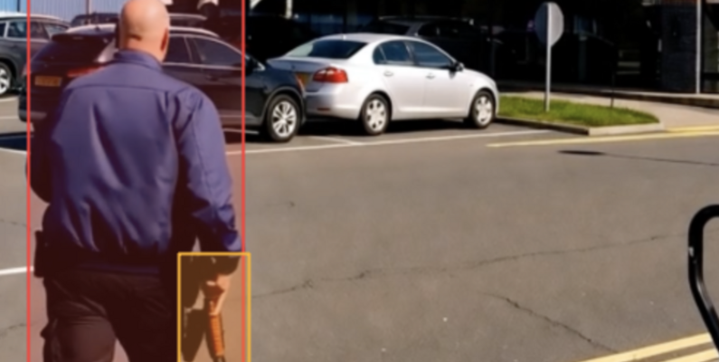

# Firearm detection in C++

This repository demonstrates how C++ is used to load a pre-trained YOLOv11 model for detecting firearms in images.




## Getting Started

### Dependencies

* [OpenCV](https://docs.opencv.org/4.x/d7/d9f/tutorial_linux_install.html)
* [LibTorch](https://docs.pytorch.org/cppdocs/installing.html)
* [CUDA Toolkit](https://developer.nvidia.com/cuda-downloads)

**Make sure LibTorch and CUDA Toolkit have the same CUDA version.**

### Build application


```
# Navigate and create build directory
cd c++
mkdir -p build && cd build
 
# Configure (please change the directory of the dependencies in CMakeLists.txt)
cmake ..
 
# Build
make

# Finally run the application
./Detect_firearm
```
## Results
A significant difference in memory efficiency was measured: the Python implementation used approximately **25%** more memory than the C++ implementation.

However, since both the Python and C++ implementations rely on the CUDA Toolkit, which uses a C/C++ compiler for kernel compilation, no noticeable difference in execution speed was observed on the GPU. 
## Acknowledgments

* [Original Python code](https://www.kaggle.com/code/jirkaborovec/cctv-weapon-train-yolo-detection)
* [Dataset](https://www.kaggle.com/datasets/simuletic/cctv-weapon-dataset)
